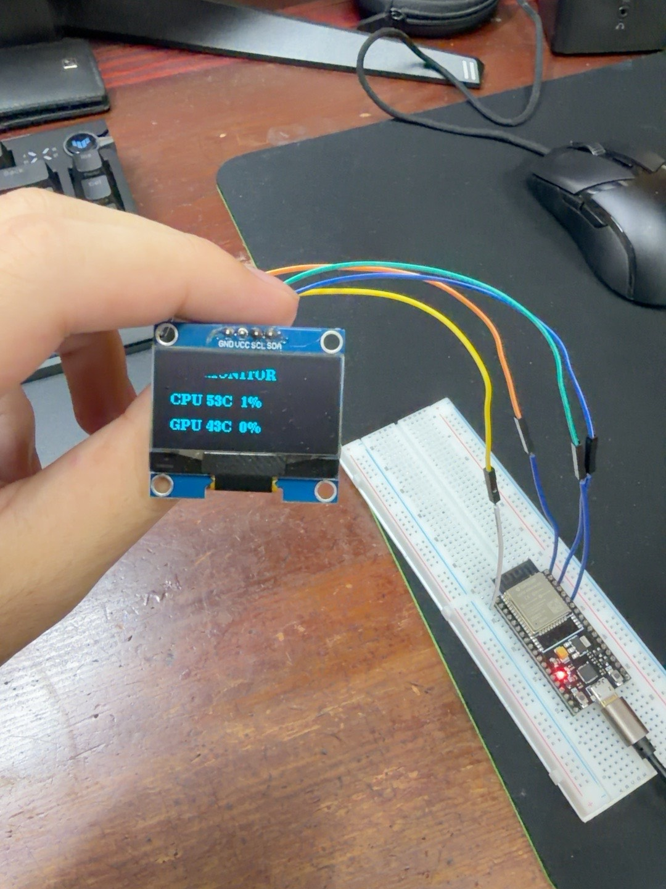
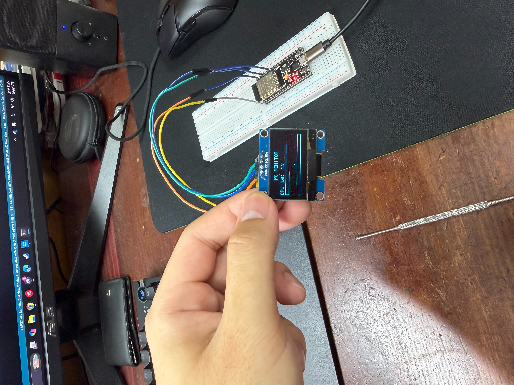

# ESP32 PC Monitor

A real-time PC hardware monitoring project using Python, ESP32, OLED display, and a local web interface.

## 📌 Project Overview

This project collects real-time hardware information from a Windows PC and sends the data to an ESP32.

The ESP32 can display the hardware information on an OLED screen and provide the data through a local network for monitoring on a smartphone.

## 🔄 System Architecture

PC Hardware Sensors  
↓  
HWiNFO  
↓  
Python  
↓  
Serial Communication  
↓  
ESP32  
↓  
OLED Display / Local Web Interface  
↓  
iPhone Browser

## ✅ Current Progress

- [x] Read PC hardware sensor data using HWiNFO
- [x] Retrieve sensor data using Python
- [x] Read CPU temperature
- [x] Read CPU load
- [x] Read GPU temperature
- [x] Read GPU load
- [x] Send PC monitoring data to ESP32
- [x] Display monitoring information on OLED
- [x] Update monitoring data approximately every 2 seconds
- [x] Access monitoring information from a smartphone through the local network

## 🛠 Hardware

- ESP32 Development Board
- 0.96" I2C OLED Display
- Windows PC

## 💻 Software

- Arduino IDE
- Python
- HWiNFO
- ESP32 Arduino Framework

## 🚧 Future Development

- [ ] Improve the OLED user interface
- [ ] Improve the mobile web dashboard
- [ ] Add historical data logging
- [ ] Add Wi-Fi connection status
- [ ] Explore Bluetooth Low Energy (BLE) communication
- [ ] Develop a native iOS monitoring application

## 📷 Project Images

### Hardware Setup

The ESP32 receives real-time PC hardware data and displays it on the OLED.

### Real-Time OLED Monitoring

CPU and GPU temperature and usage are displayed in real time.

## 📖 Project Status

**Version 0.1 — Work in Progress**

The basic communication and real-time monitoring functions are currently operational.

##  How to Run

1. Start HWiNFO and enable the local web server.
2. Connect the ESP32 to the PC via USB.
3. Upload `esp32/ESP32_PC_Monitor.ino` to the ESP32.
4. Install the required Python packages:

   `pip install -r python/requirements.txt`

5. Run the Python monitoring script:

   `python python/pc_monitor.py`

6. The ESP32 OLED will display the PC hardware information in real time.
